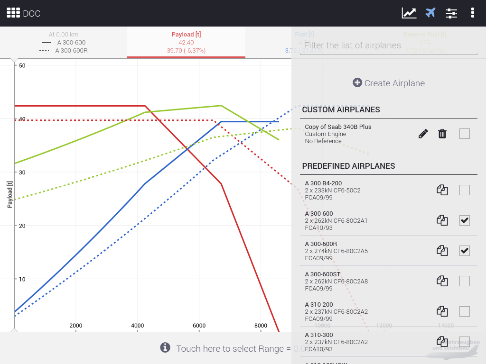
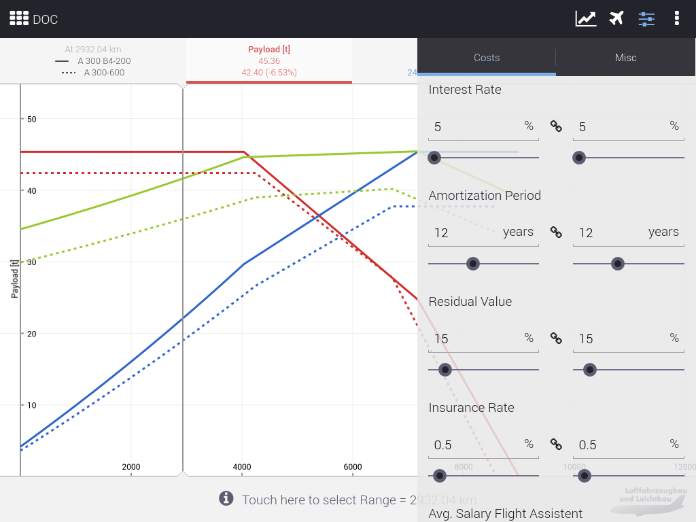
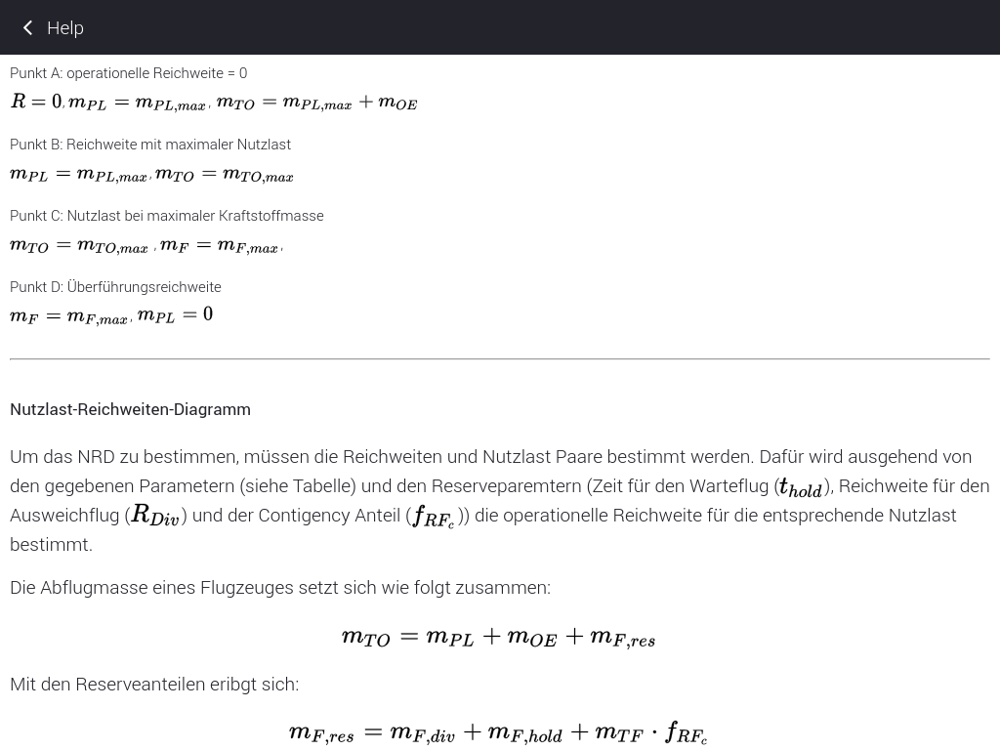
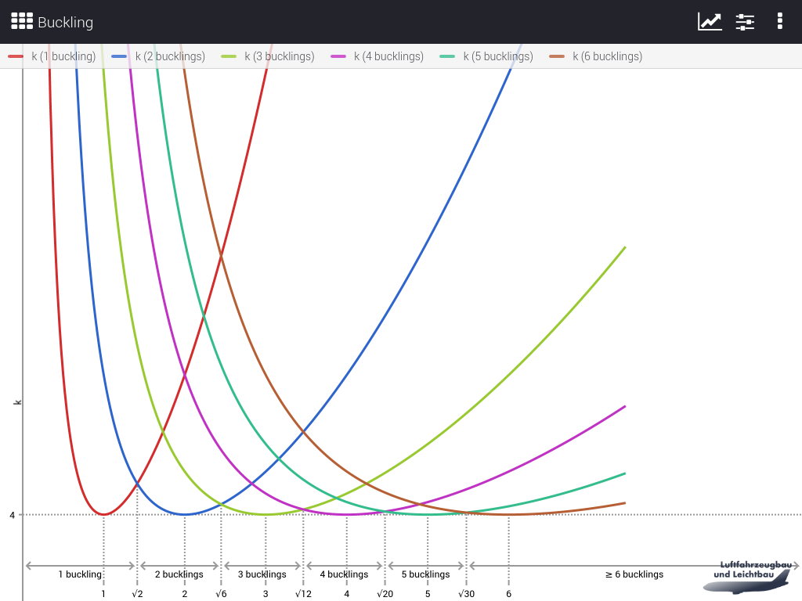
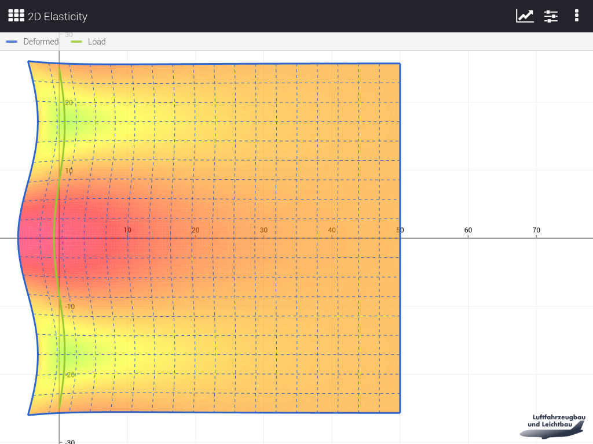

# E-Learning-Webapps Luftfahrzeugbau und Leichtbau

Dieses Projekt umfasst eine Reihe von E-Learning-Webapps, die zur
Unterstützung der Lehre am Fachgebiet Luftfahrzeugbau und Leichtbau am
Institut für Luft- und Raumfahrt an der Technischen Universität Berlin
entwickelt wurden. Die einzelnen Apps visualisieren jeweils komplexe
fachliche Zusammenhänge graphisch.

[Link zur aktuellen Online-Version der Apps](http://comet.ilr.tu-berlin.de/app)

## Features

Die Apps sind vollständig nutzbar auf allen Geräten von Smartphone bis
Desktop.

Die Übersichtsseite listet die einzelnen Apps gruppiert in Kacheln
auf. Die skizzierten Graphen bieten einen hohen Wiedererkennungswert.
Eine Suchfunktion steht zur Verfügung.

Die einzelnen Apps bestehen aus einem großen Darstellungsbereich und
einem oder mehreren Asides. Die Nutzung des Darstellungsbereichs
geschieht von App zu App sehr flexibel - die Screenshots (s.u.) geben
einen Überblick, was bisher umgesetzt wurde.

Die Asides verwalten alle Arten von Einstellungsmöglichkeiten für den
Darstellungsbereich übersichtlich. Typischerweise gibt es zum Beispiel
ein Aside, in dem verschiedene Kurven aus- und abgewählt werden können
sowie ein Aside, in dem Berechnungsparameter verändert werden können.
Die Aktualisierung des Darstellungsbereichs erfolgt live.

Die Möglichkeiten sind auch hier sehr flexibel. Es ist beispielsweise
auch möglich, über Asides Entitäten wie verschiedene Flugzeugtypen zu
verwalten und auszuwählen, die der Darstellung zugrunde liegen (siehe
Screenshots).

Die Share-Funktionalität ermöglicht es, einen Link zu erstellen, der
die aktuelle Ansicht und Parameter enthält, sodass beim Öffnen des
Links exakt derselbe Zustand wiederhergestellt wird.

## Screenshots
















## Installation

Da es sich um eine Web-Applikation ohne Backend handelt, kann eine
beliebige HTTP-Server-Software zur Bereitstellung verwendet werden. Es
werden serverseitig keine weiteren Technologien benötigt.

Ruby, Bundler und Node.js vorausgesetzt sind folgende Schritte zum
Erstellen des `public`-Ordners notwendig:

```
npm install nib poised stylus
bundle install
bundle exec rake build
```

Kopieren Sie nun einfach den `public`-Ordner in ein beliebiges
Verzeichnis auf Ihrem Server, das von der HTTP-Server-Software
ausgeliefert wird. Die HTTP-Server-Software sollte so konfiguriert
sein, dass `index.html`-Dateien automatisch geladen werden, wenn der
Ordner über HTTP aufgerufen wird. Damit ist die Installation komplett.

## Konfiguration und Modifikationen

### App-Hilfen hinzufügen/editieren

Die Hilfe-Texte befinden sich im `/help/` und haben den Namen der
jeweiligen App mit der Dateiendung `.md.txt`.

Unterschiedliche Apps werden mit einem "Hash-Pfad" aufgerufen. Wird
die Aliasing-App aufgerufen, endet die URL in der Adressleiste des
Browsers mit `#app/aliasing`. Die dazugehörige Hilfetext-Datei muss
dann in `help/aliasing.md.txt` gespeichert werden.

Bei Sub-Apps hat der Hash-Pfad beispielsweise das Format
`#app/airplaneInternalLoads/wing`. In diesem Fall werden die
untergliedernden Slashes durch Unterstriche ersetzt und der
resultierende Pfad für die Hilfetext-Datei ist im Beispiel
`help/airplaneInternalLoads_wing.md.txt`.

Die Hilfetext-Datei, die von der Übersichtsseite aus erreichbar ist,
muss `about.md.txt` heißen.

Für die Bearbeitung dieser Texte empfehlen wir
[StackEdit](https://stackedit.io/). Dieser zeigt bei der Bearbeitung
live die HTML-Darstellung an, wie sie dann auch in der App aussehen
wird.

### Default-Werte anpassen

Sämtliche Werte der App sind in die separate Datei
`settings.default.yml` im YAML-Format ausgelagert. Diese Datei darf
allerdings nicht verändert werden, weil Veränderungen beim nächsten
App-Update dann verloren gehen würden. Um Werte anzupassen, muss im
selben Ordner eine Datei mit dem Namen `settings.default.yml.txt`
angelegt werden, mit der einzelne Werte überschrieben werden können.
Diese Datei sollte nur genau die Werte überschreiben, die auch
tatsächlich geändert werden sollen.

Beispiel einer `settings.overwrite.yml.txt`-Datei:

```
directOperatingCosts:
  airplanes:
    A 300 B4-200:
      speed: 855
    ILR Super Aircraft:
      maxTakeOffMass: 165000
      maxFuelMass: 59646
      operationEmptyMass: 80640
      maxPayload: 45360
      maxRange: 8412
      speed: 2300
      engineCount: 6
      slst: 233
      engine: 6 x 233kN CF6-50C2
      reference: ILR12345
beamSectionProperties:
  zProfile:
    defaults:
      h: 12.5
```

Im Kopf der Datei `settings.default.yml` ist beschrieben, wie die
Einstellungen pro App strukturiert sind und welche Einstellungen
möglich sind.

### Labels anpassen

Sämtliche Labels der App sind in die separate Datei
`labels.default.yml.txt` im YAML-Format ausgelagert. Diese Datei darf
allerdings nicht verändert werden, weil Veränderungen beim nächsten
App-Update dann verloren gehen würden. Um Labels anzupassen, muss im
selben Ordner eine Datei mit dem Namen `labels.overwrite.yml.txt`
angelegt werden, mit der einzelne Werte überschrieben werden können.
Diese Datei sollte nur genau die Werte überschrieben, die auch
tatsächlich geändert werden sollen.

Beispiel einer `labels.overwrite.yml.txt`-Datei:

```
airplaneInternalLoads:
  fuselage:
    shortTitle: FLL
mohrsCircle:
  shortTitle: Mohr's Circus
```

## Entwicklung

Beim Entwickeln liefert guard die kompilierten Dateien aus:

```
npm install nib poised stylus
bundle install
bundle exec guard
```

Der Zugriff erfolgt über http://localhost:9292.

Parallel steht auch Jasmine zur Live-Ausführung der Tests zur Verfügung:

```
bundle exec rake jasmine
```

Der Zugriff erfolgt über http://localhost:8888.

## Credits

Die Entwicklung der Apps wurde gefördert vom Bundesministerium für
Bildung und Forschung.
