# Aircraft Construction E-Learning Webapps

This project consists of a series of e-learning webapps build to support teaching at the department of aircraft construction, institute of aerospace at the Berlin Institute of Technology ("Technische Universität Berlin").

Sorry, a comprehensive readme is currently only available [in German](README.de.md).

## Screenshots

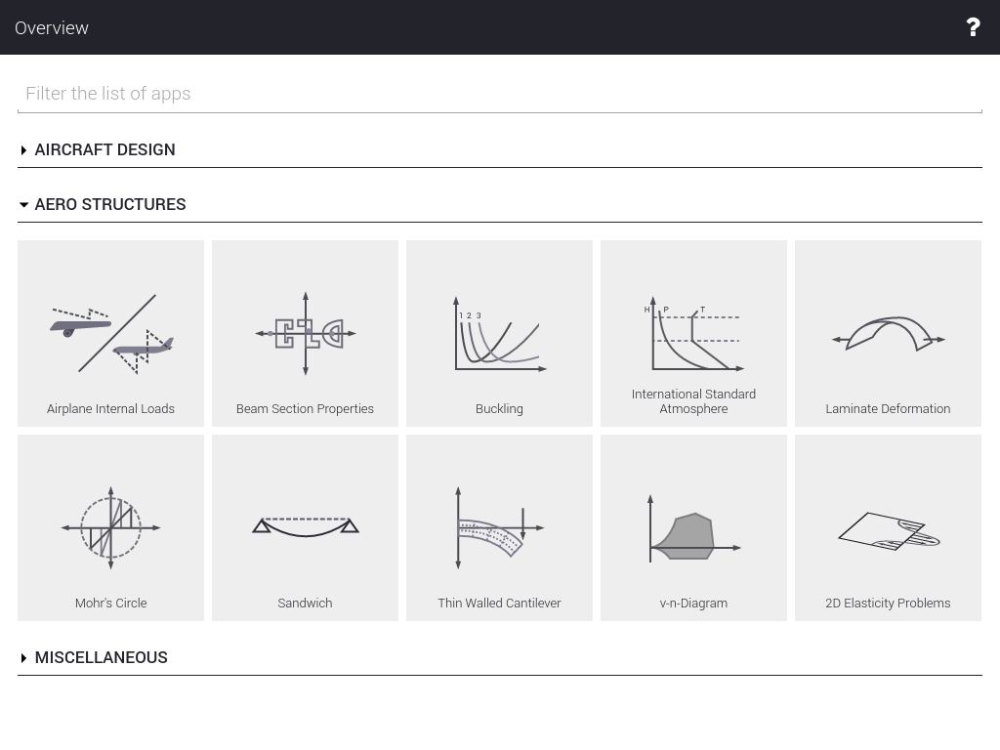

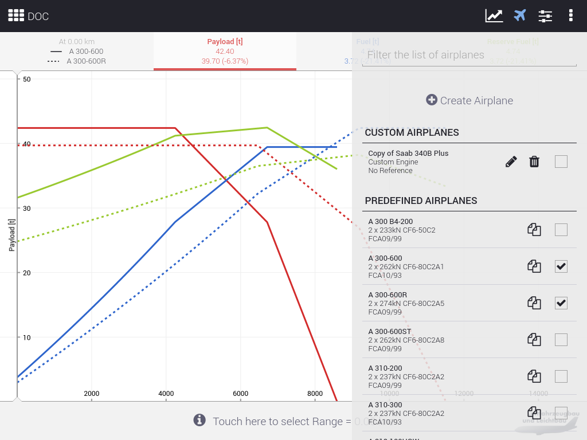

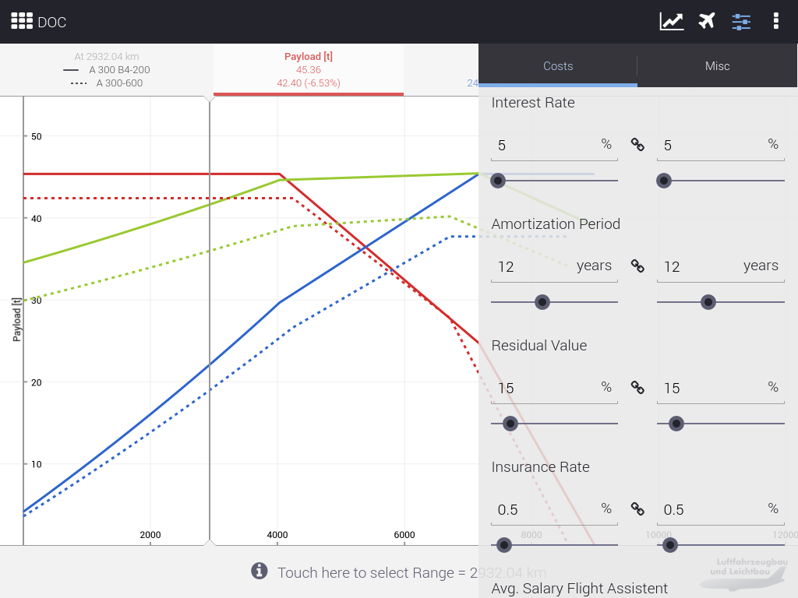

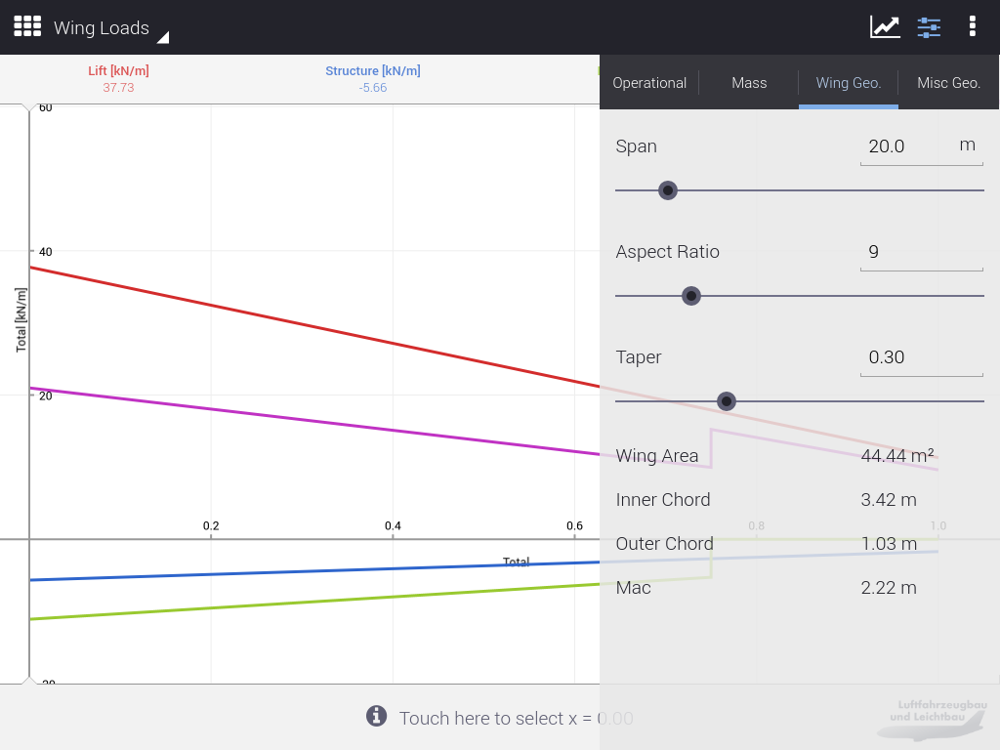

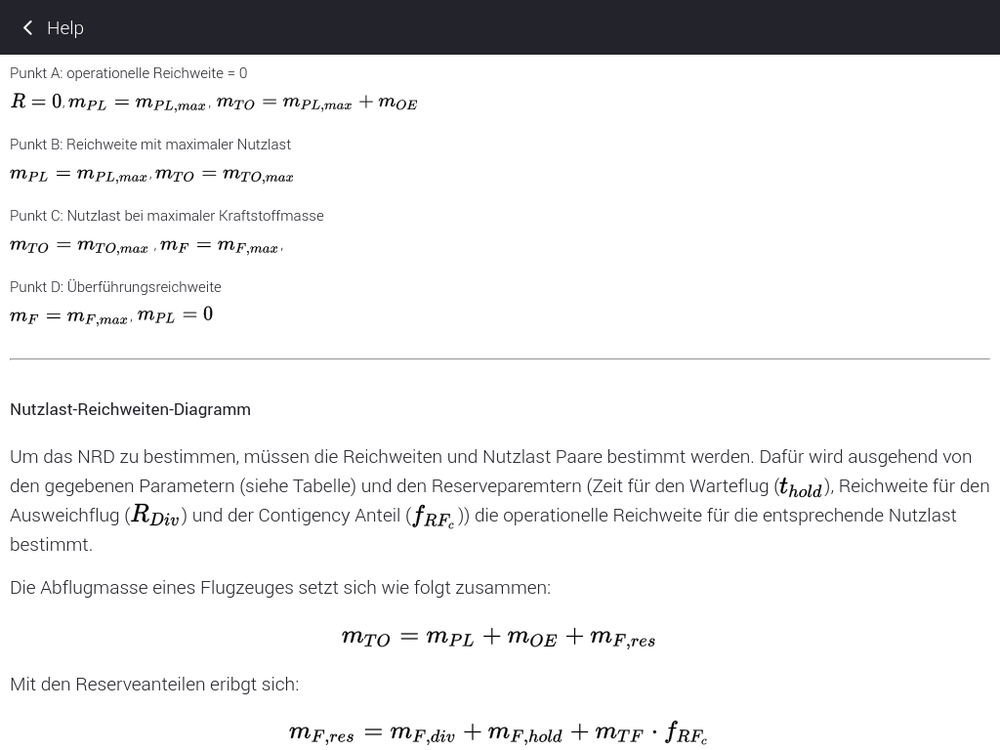

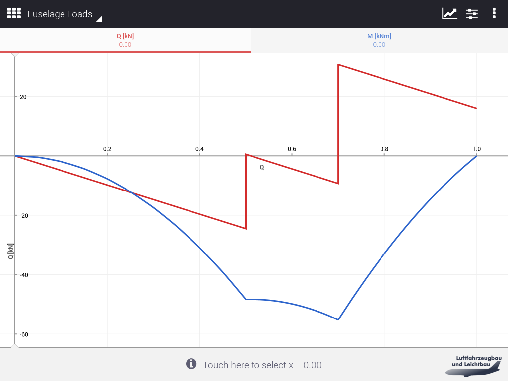

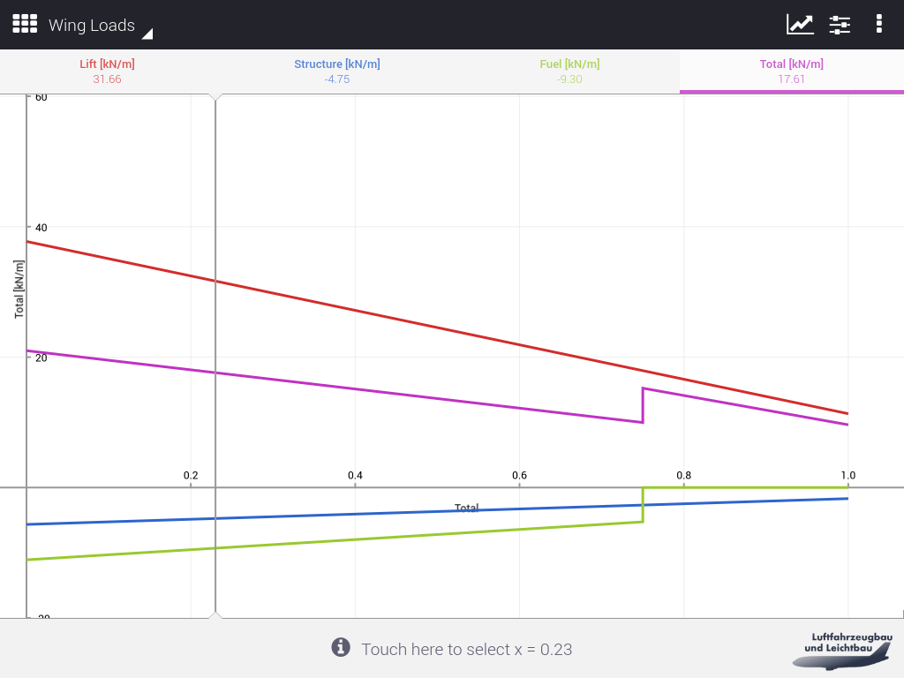

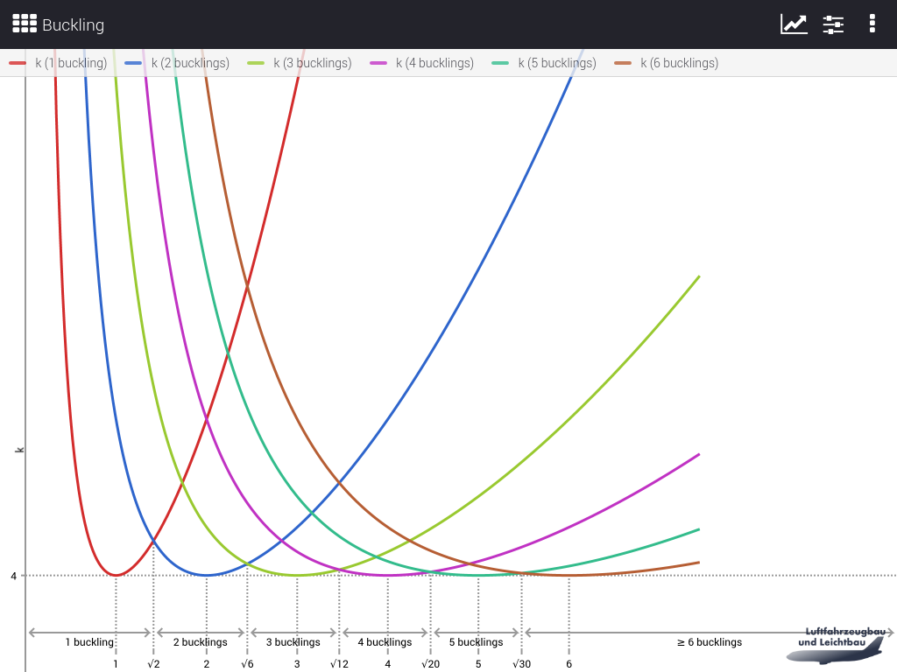

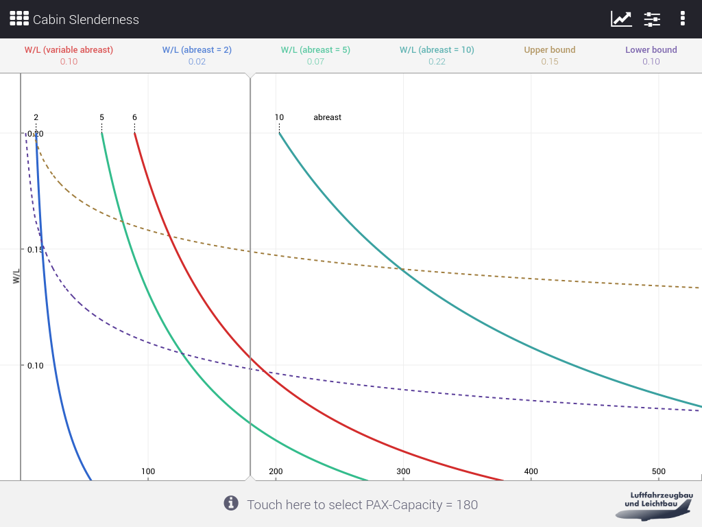

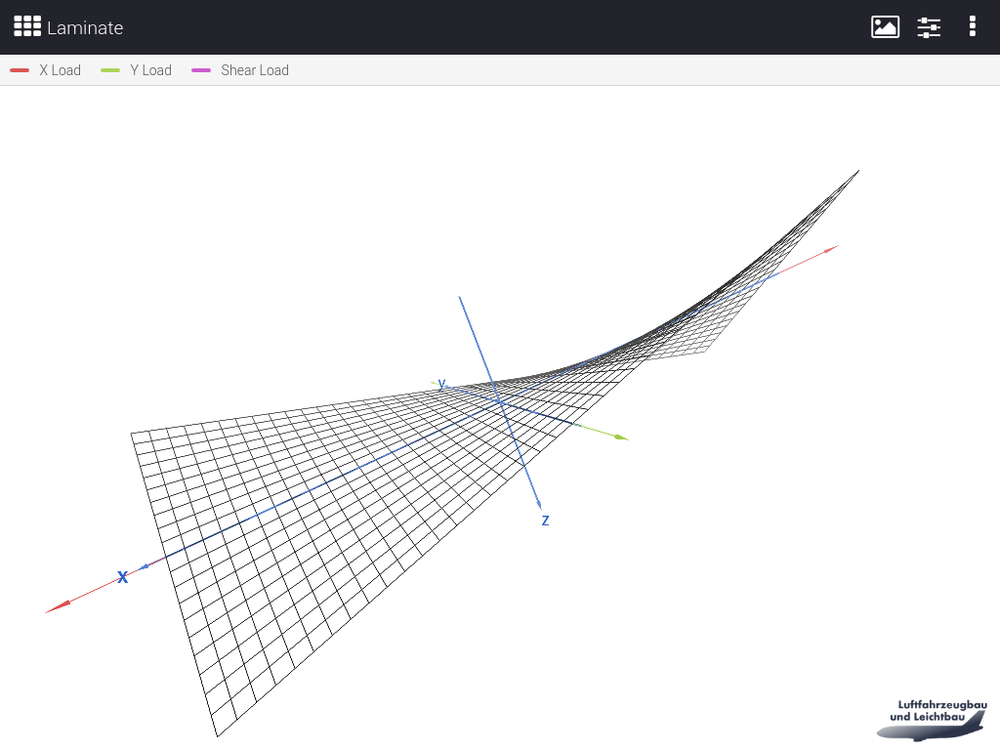

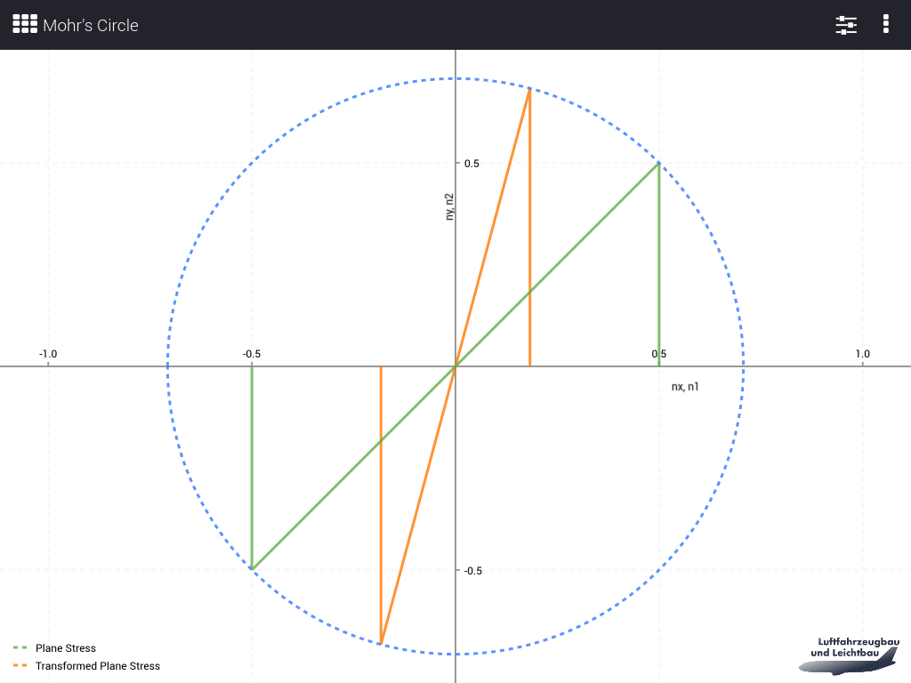

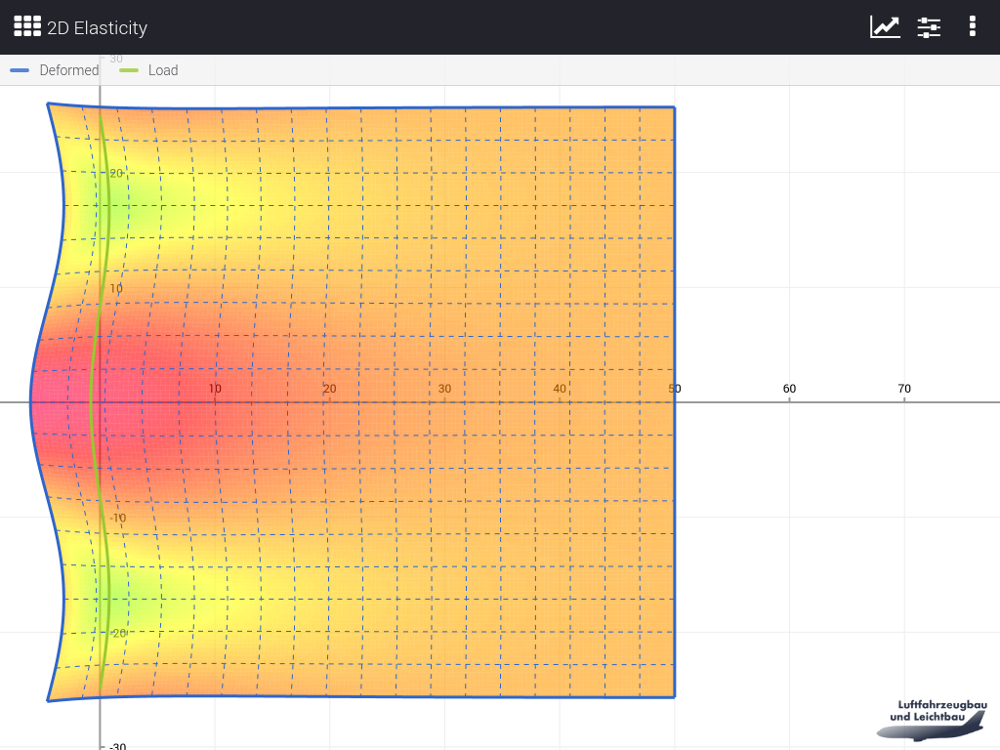

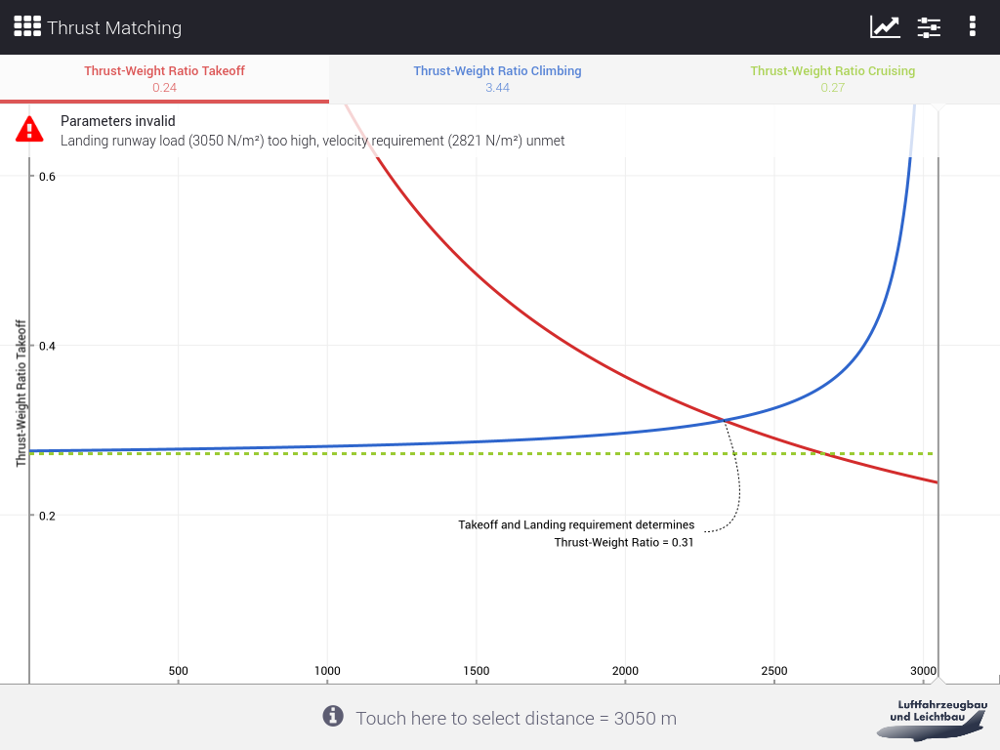
